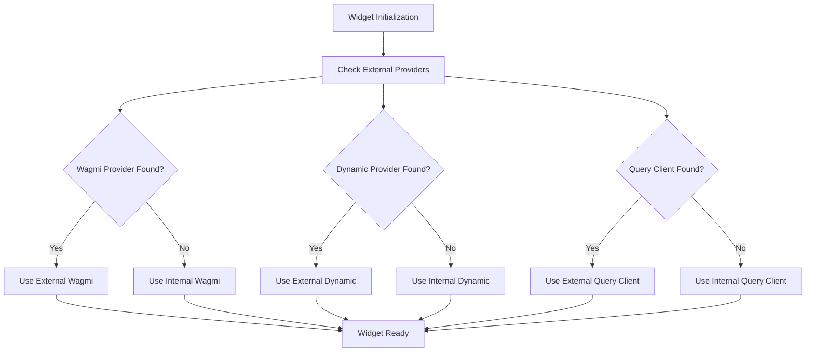

# Wallet Management

Overview

The Blockend Widget features intelligent wallet management that seamlessly integrates with your existing dApp's wallet setup. The widget automatically detects and reuses external wallet providers when available, providing a unified user experience without requiring users to connect multiple times.

### Key Features

* **Automatic Provider Detection**: Detects existing Wagmi, Dynamic Labs, and TanStack Query providers
* **Multi-Chain Support**: Handles automatic provider detection(External Providers) for EVM and Solana.
* **Fallback Providers**: Uses internal providers when external ones aren't available for the supported ecosystems.
* **Zero Configuration**: Works out of the box with Wagmi and @dynamic-labs(Solana) based libraries

### Architecture

The widget uses a conditional provider system that checks for external providers before initialising internal ones:



### Supported Provider Libraries

#### EVM Wallet Management

The widget supports the following EVM wallet management libraries:

* **Wagmi v2**: Core Web3 React library
* **RainbowKit**: Built on top of Wagmi
* **Reown AppKit** (formerly WalletConnect): Universal wallet connector

#### Solana Wallet Management

* **Dynamic Labs**: Solana support
* **Solana Wallet Adapter**: Standard Solana wallet library

### Integration Examples

#### Basic Integration (Uses Internal Providers)

```jsx
import Blockend from "@blockend/widget";
import "@blockend/widget/dist/style.css";

function App() {
  return (
    <div>
      {/* Widget will use its internal providers */}
      <Blockend
        configuration={{
          integratorId: "your-integrator-id",
        }}
      />
    </div>
  );
}
```

## Integration for EVM wallets

#### Integration with Wagmi

```jsx
import { WagmiProvider, createConfig, http } from "wagmi";
import { mainnet, polygon, arbitrum } from "wagmi/chains";
import { injected, walletConnect } from "wagmi/connectors";
import Blockend from "@blockend/widget";
import "@blockend/widget/dist/style.css";

const config = createConfig({
  chains: [mainnet, polygon, arbitrum],
  connectors: [injected(), walletConnect({ projectId: "your-project-id" })],
  transports: {
    [mainnet.id]: http(),
    [polygon.id]: http(),
    [arbitrum.id]: http(),
  },
});

function App() {
  return (
    <WagmiProvider config={config}>
      {/* Widget automatically detects and uses your Wagmi setup */}
      <Blockend
        configuration={{
          integratorId: "your-integrator-id",
        }}
      />
    </WagmiProvider>
  );
}
```

#### Integration with RainbowKit

```jsx
import "@rainbow-me/rainbowkit/styles.css";
import { QueryClient, QueryClientProvider } from "@tanstack/react-query";
import { WagmiProvider } from "wagmi";
import { RainbowKitProvider, getDefaultConfig } from "@rainbow-me/rainbowkit";
import { mainnet, polygon, arbitrum } from "wagmi/chains";
import Blockend from "@blockend/widget";
import "@blockend/widget/dist/style.css";

const config = getDefaultConfig({
  appName: "My RainbowKit App",
  projectId: "YOUR_WALLETCONNECT_PROJECT_ID",
  chains: [mainnet, polygon, arbitrum],
});

const queryClient = new QueryClient();

function App() {
  return (
    <WagmiProvider config={config}>
      <QueryClientProvider client={queryClient}>
        <RainbowKitProvider>
          {/* Widget uses your RainbowKit/Wagmi setup */}
          <Blockend
            configuration={{
              integratorId: "your-integrator-id",
            }}
          />
        </RainbowKitProvider>
      </QueryClientProvider>
    </WagmiProvider>
  );
}
```

**Important**: For the widget to work on all supported chains, you must add the widget-supported chains to your Wagmi configuration. Here is the list of supported EVM chains:

Ethereum (mainnet)\
Polygon\
Arbitrum\
Optimism\
BSC\
zkSYNC Era\
BASE\
Avalanche\
Gnosis\
Fantom\
Moonriver\
Moonbeam\
Fuse\
OKXchain\
Boba\
Aurora\
Cronos\
Heco\
Harmony\
Linea\
RootStock\
Mode\
Celo\
Mantle\
Scroll\
Blast\
Berachain\
Unichain\
Sonic\
Story\
Polygon zkEVM

Alternatively, you can dynamically fetch the latest supported chains by calling the Blockend API and filtering for EVM chains using `networkType: 'evm'`:

```bash
curl -X GET "https://api2.blockend.com/v1/chains"
```

This approach ensures you always have the most up-to-date list of supported chains.


## Integration for Solana wallets

#### Integration with Dynamic Labs for Solana wallets

<pre class="language-jsx"><code class="lang-jsx">import { DynamicContextProvider } from "@dynamic-labs/sdk-react-core";
<strong>import { SolanaWalletConnectors } from "@dynamic-labs/solana";
</strong>import Blockend from "@blockend/widget";
import "@blockend/widget/dist/style.css";

function App() {
  return (
    &#x3C;DynamicContextProvider
      settings={{
        environmentId: "your-environment-id",
        walletConnectors: [SolanaWalletConnectors],
      }}
    >
      {/* Widget uses your Dynamic setup for Solana */}
      &#x3C;Blockend
        configuration={{
          integratorId: "your-integrator-id",
        }}
      />
    &#x3C;/DynamicContextProvider>
  );
}
</code></pre>

#### Full Stack Integration

```jsx
import { WagmiProvider, createConfig, http } from "wagmi";
import { QueryClient, QueryClientProvider } from "@tanstack/react-query";
import { DynamicContextProvider } from "@dynamic-labs/sdk-react-core";
import { SolanaWalletConnectors } from "@dynamic-labs/solana";
import { mainnet, polygon, arbitrum } from "wagmi/chains";
import { injected, walletConnect } from "wagmi/connectors";
import Blockend from "@blockend/widget";
import "@blockend/widget/dist/style.css";

const wagmiConfig = createConfig({
  chains: [mainnet, polygon, arbitrum],
  connectors: [injected(), walletConnect({ projectId: "your-project-id" })],
  transports: {
    [mainnet.id]: http(),
    [polygon.id]: http(),
    [arbitrum.id]: http(),
  },
});

const queryClient = new QueryClient();

function App() {
  return (
    <QueryClientProvider client={queryClient}>
      <WagmiProvider config={wagmiConfig}>
        <DynamicContextProvider
          settings={{
            environmentId: "your-environment-id",
            walletConnectors: [SolanaWalletConnectors],
          }}
        >
          {/* Widget uses all your external providers */}
          <Blockend
            configuration={{
              integratorId: "your-integrator-id",
            }}
          />
        </DynamicContextProvider>
      </WagmiProvider>
    </QueryClientProvider>
  );
}
```

### Troubleshooting

#### Common Issues

**1. Widget Not Detecting External Providers**

**Problem**: Widget uses internal providers even when external ones are available.

**Solution**: Ensure the widget is wrapped inside the provider components:

```jsx
// ❌ Incorrect - Widget outside providers
<div>
  <Blockend />
  <WagmiProvider config={config}>
    <YourApp />
  </WagmiProvider>
</div>

// ✅ Correct - Widget inside providers
<WagmiProvider config={config}>
  <div>
    <YourApp />
    <Blockend />
  </div>
</WagmiProvider>
```

**2. Chain Switching Issues**

**Problem**: Chain switching doesn't work properly.

**Solution**: Ensure your Wagmi config includes all the chains supported by the widget:

```jsx
const config = createConfig({
  chains: [
    mainnet,
    polygon,
    arbitrum, // Add all supported chains
  ],
  // ... rest of config
});
```

**3. Multiple Wallet Connection Prompts**

**Problem**: Users see multiple wallet connection prompts.

**Solution**: This usually happens when providers are not properly detected. Check the browser console for provider detection logs.

**4. Solana Wallet Issues**

**Problem**: Solana wallets not working with Dynamic Labs integration.

**Solution**: Ensure you have the correct Dynamic Labs environment setup:

```jsx
<DynamicContextProvider
  settings={{
    environmentId: 'your-environment-id', // Correct environment ID
    walletConnectors: [SolanaWalletConnectors], // Include Solana connectors
    initialAuthenticationMode: 'connect-only',
  }}
>
```

### Migration Guide

#### From Internal to External Providers

If you're currently using the widget with internal providers and want to migrate to external providers:

**Step 1: Install Required Dependencies**

```bash
npm install wagmi viem @tanstack/react-query
# or for Solana
npm install @dynamic-labs/sdk-react-core @dynamic-labs/solana
```

**Step 2: Wrap Your App**

```jsx
// Before
function App() {
  return <Blockend configuration={configuration} />;
}

// After
function App() {
  return (
    <WagmiProvider config={wagmiConfig}>
      <QueryClientProvider client={queryClient}>
        <Blockend configuration={configuration} />
      </QueryClientProvider>
    </WagmiProvider>
  );
}
```

**Step 3: Test Integration**

Verify that:

* Wallet connections work correctly
* Chain switching functions properly
* Transaction signing operates as expected
